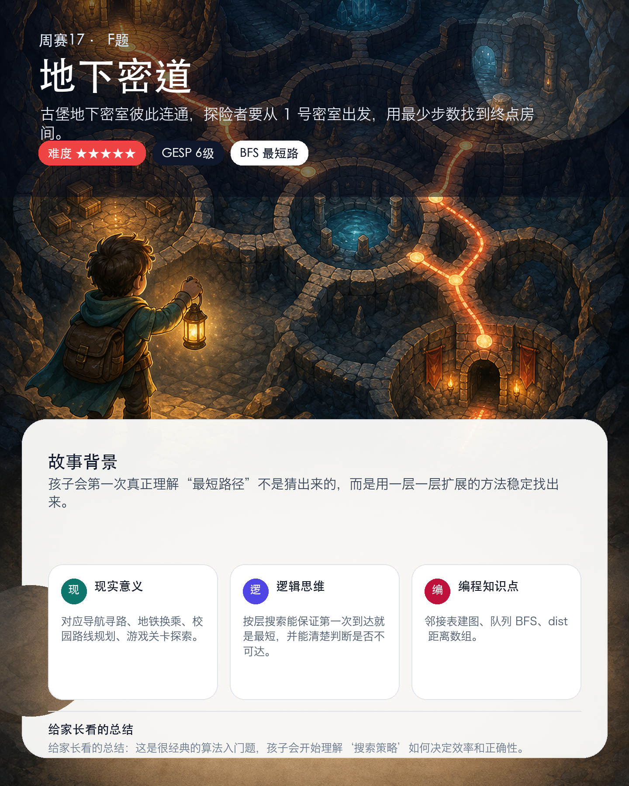

# 📣 周赛 17 ·《神秘古堡》开赛啦！

> 本文为微信公众号推文文案，可直接复制粘贴。图片为各题「学习价值海报」，发布时按顺序插入即可（路径见每段下方）。

---

## 开篇

本周的少儿编程周赛，我们带孩子走进一座**神秘古堡** 🏰。

从大门的密码锁，到地下的密道探险——6 道题，6 个关卡，难度由浅入深（GESP 1 级 → 6 级）。孩子在闯关解谜的同时，悄悄掌握的是**真正能迁移到生活与学习里的编程思维**。

下面带各位家长逐题看看，孩子这一周到底在练什么 👇

---

## 🅰️ A 题 · 密码校验　|　难度 ★☆☆☆☆　GESP 1 级

古堡大门只认「左右对称」的四位密码。孩子要学会把一个数字**拆开、逐位检查**。

- **现实意义**：门禁码、编号、车牌里常见的对称识别规则。
- **思维训练**：先拆成部分，再逐条判断。
- **编程收获**：整数取位、if 条件判断、多组数据输入输出。

---

## 🅱️ B 题 · 宝藏众数　|　难度 ★★☆☆☆　GESP 2 级

古堡宝库里散落着许多编号宝藏，孩子要找出**出现次数最多**、最值得优先寻找的那一类。

- **现实意义**：投票计票、销售统计、错题高频项分析。
- **思维训练**：先统计，再比较，最后处理「并列取最小」的细节。
- **编程收获**：计数数组、遍历求最大值。

---

## 🅲 C 题 · 卷宗整理　|　难度 ★★★☆☆　GESP 3 级

古堡图书馆堆满卷宗，孩子要筛出密级为 A 的资料，并按案件编号整理成清楚的目录。

- **现实意义**：档案整理、名单筛选、图书目录排序。
- **思维训练**：先按条件过滤，再按关键字排序，还要考虑「没有结果」的情况。
- **编程收获**：结构体存信息、条件筛选、自定义排序。

---

## 🅳 D 题 · 山峰统计　|　难度 ★★★★☆　GESP 4 级

古堡地图是一张高度网格，孩子要逐格比较四周，找出真正高过邻居的「山峰」。

- **现实意义**：地图高点识别、区域监测、游戏地形分析。
- **思维训练**：对每个格子检查上下左右，严格比较并处理边界。
- **编程收获**：二维数组、方向数组、嵌套循环、边界判断。

---

## 🅴 E 题 · 大数相减　|　难度 ★★★★★　GESP 5 级

古堡宝库记录的是超大数字，普通整数都装不下。孩子要像**手算**一样，逐位借位完成减法。

- **现实意义**：金融大额数据、库存统计、科学计数等超长数字处理。
- **思维训练**：从低位到高位，一步都不能漏掉借位。
- **编程收获**：字符串转数字数组、高精度减法、去前导零。

---

## 🅵 F 题 · 地下密道　|　难度 ★★★★★　GESP 6 级

古堡地下密室彼此连通，孩子要从 1 号密室出发，用**最少步数**抵达终点。

- **现实意义**：导航寻路、地铁换乘、校园路线规划、游戏关卡探索。
- **思维训练**：一层一层向外扩展，保证第一次到达就是最短路径。
- **编程收获**：邻接表建图、队列 BFS、距离数组。

---

## 结尾

6 道题，是 6 次「把复杂问题拆开、一步步解决」的练习 🧩。

欢迎孩子们登录平台参加本周周赛，在闯关里成长！本次为 **OI 赛制**——做对得分、又快又准排名更高，时间很关键哦 ⏱️

> 关注我们，每周陪孩子一起闯关编程世界 🚀
